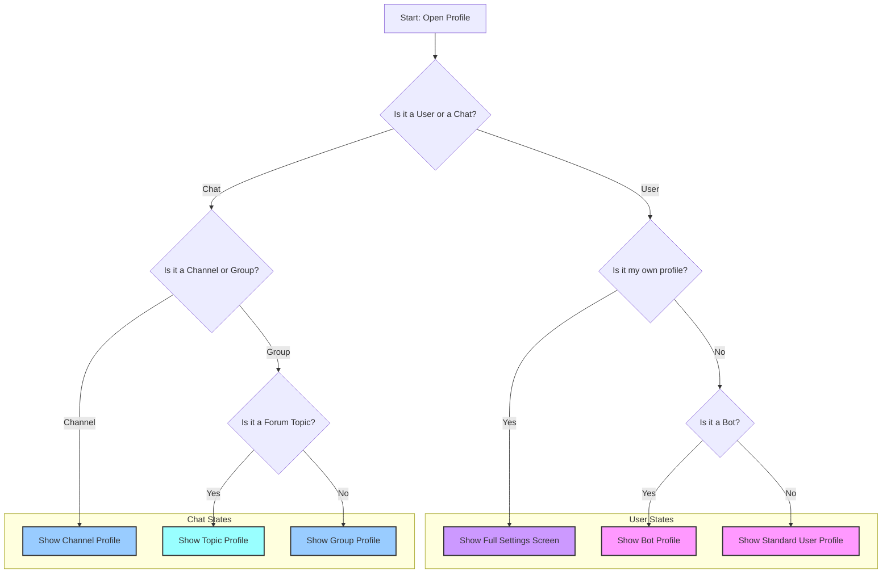

# Modernization Plan for ProfileActivity (Programmatic UI Refactor)

This document outlines a detailed plan to refactor `ProfileActivity.java`. The goal is to modernize the screen's architecture by making it more modular and maintainable, without migrating to XML layouts, thereby preserving the performance of the existing programmatic UI approach.

## The Problem

`ProfileActivity.java` is a classic "God Object." It is a single, massive class (over 14,000 lines) responsible for:

*   **UI View Creation**: Programmatically creating dozens of different types of `View` objects.
*   **UI View Binding**: Populating these views with data.
*   **State Management**: Tracking complex state like user permissions, premium status, online status, etc.
*   **Business Logic**: Handling user interactions, data fetching, and API calls.
*   **Theming**: Applying a complex, custom theming engine.

This makes the code difficult to read, debug, and modify. Changing one part of the UI can have unintended consequences elsewhere.

## The Solution: Component-Based Architecture in Java

We will break down the monolithic `ProfileActivity` into smaller, more focused components. Each component will be a plain Java class responsible for a logical section of the profile screen. This is often called a **Renderer** or **View-Binder** pattern.

### Core Principles

*   **No XML Layouts**: We will continue to create all UI components in Java to maintain performance and respect the existing architecture.
*   **Separation of Concerns**: Each new "Renderer" class will encapsulate the logic for one specific part of the UI.
*   **Incremental Refactoring**: We will refactor the screen one section at a time, ensuring the app remains fully functional after each step.

---

## Profile States Visualization

The profile screen is not one single UI, but a container that renders many different layouts based on context. The diagram below illustrates the main states that determine its appearance. Understanding these states is key to the refactoring effort.

---

## The Refactoring Plan

### Phase 1: Create the First Renderer Component (User Info)

*   **Goal**: Extract the logic for the main user information block (phone, username, bio) into its own component.
*   **Status**: ✅ **Done**
*   **Actions**:
    1.  [x] Create a new class `UserInfoRenderer.java` in `org.telegram.ui.Components`.
    2.  [x] This class will have methods like `createView(int viewType)` and `bindView(View view, int rowId, ...)`.

### Phase 2: Integrate the Renderer and Refactor Incrementally

*   **Goal**: Start using the new renderer in `ProfileActivity` and move the relevant code into it.
*   **Status**: ⬜️ **To-Do**
*   **Actions**:
    1.  **Instantiate Renderer**: In `ProfileActivity`, create an instance of `UserInfoRenderer`.
    2.  **Delegate View Creation**:
        *   In `ProfileActivity.ListAdapter.onCreateViewHolder`, find the `switch` statement.
        *   For `case VIEW_TYPE_TEXT_DETAIL:` and `case VIEW_TYPE_ABOUT_LINK:`, replace `new TextDetailCell(mContext)` with a call to `userInfoRenderer.createView(...)`.
    3.  **Delegate View Binding**:
        *   In `ProfileActivity.ListAdapter.onBindViewHolder`, find the `switch` statement.
        *   Move the complex `if/else` block that handles `phoneRow`, `usernameRow`, and `bioRow` into the `UserInfoRenderer.bindView` method.
        *   The `onBindViewHolder` method in `ProfileActivity` will be simplified to a single call: `userInfoRenderer.bindView(...)`.
    4.  **Verify**: Compile and run the app to ensure the user info section still displays correctly.

### Phase 3: Create Renderers for Other Sections

*   **Goal**: Repeat the pattern for every other logical section of the profile screen.
*   **Status**: ⬜️ **To-Do**
*   **Actions**: Create the following Renderer classes and move the corresponding logic into them:

    *   `**SettingsRenderer.java`**:
        *   **Responsibility**: The block of general app settings (Notifications, Privacy, Data, etc.) that appears on the user's own profile.
        *   **Views to move**: `notificationRow`, `privacyRow`, `dataRow`, `chatRow`, etc.
    *   `**MembersRenderer.java`**:
        *   **Responsibility**: The list of members in a group or subscribers in a channel.
        *   **Views to move**: `membersStartRow` to `membersEndRow`, `addMemberRow`, `subscribersRow`, etc.
    *   `**ActionRenderer.java`**:
        *   **Responsibility**: The main action buttons like "Send Message," "Block User," "Share Contact."
        *   **Views to move**: `sendMessageRow`, `unblockRow`, `addToContactsRow`, etc.
    *   `**SharedMediaRenderer.java`**:
        *   **Responsibility**: Manages the `SharedMediaLayout` component. This will mostly be a wrapper around the existing `SharedMediaLayout` to keep the adapter clean.
        *   **Views to move**: `sharedMediaRow`.
    *   `**DebugRenderer.java`**:
        *   **Responsibility**: The hidden debug and version information section.
        *   **Views to move**: `debugHeaderRow`, `sendLogsRow`, `versionRow`, etc.

### Final Result

After completing this plan:

*   `ProfileActivity.ListAdapter` will be dramatically simplified. Its `onCreateViewHolder` and `onBindViewHolder` methods will mostly contain a `switch` statement that delegates to the appropriate renderer.
*   The logic for each part of the UI will be isolated in its own file (`UserInfoRenderer.java`, `SettingsRenderer.java`, etc.), making it easy to find, understand, and modify.
*   The overall performance will be unchanged because we are still using the same high-performance, programmatic UI creation methods.
*   "Re-UIing" the screen becomes a matter of changing the logic within a specific renderer, which is a much more targeted and less risky process.

---

## Phase 4: Implementing New Channel UI Design

Since the ProfileActivity is complex, we'll implement the new channel UI in small, testable increments.

### Step 4.1: Create UI Components (✅ Done)
- [x] Create `ChannelProfileHeaderCell.java` - The header with avatar, name, and action buttons
- [x] Create `ChannelProfileInfoCell.java` - The info section with description and link

### Step 4.2: Minimal Integration Test
**Goal**: Get the new cells showing in the app without breaking anything
1. [x] Add a feature flag method `isNewChannelProfileStyle()` that returns `false` initially
2. [x] Add the new view types to ListAdapter
3. [x] Add minimal cases in `onCreateViewHolder` that create the new cells
4. [x] Add cases in `onBindViewHolder` to populate the cells with data
5. [x] Add logic in `updateRowsIds()` to include the new rows when feature flag is enabled
6. [x] Add cases in `getItemViewType()` to return correct view types
7. [ ] Test by temporarily forcing the flag to `true` for one specific channel

### Step 4.3: Move Logic Incrementally
**Goal**: Move existing logic piece by piece
1. Move avatar display logic from the complex header to `ChannelProfileHeaderCell`
2. Move channel name and subscriber count logic
3. Move action button logic (Join, Share, etc.) from ActionBar to the new cell
4. Move description display logic to `ChannelProfileInfoCell`

### Step 4.4: Polish and Cleanup
1. Remove old UI code paths for channels when new style is enabled
2. Handle edge cases (loading states, errors, permissions)
3. Ensure theming works correctly with the new components

### Implementation Strategy

To keep changes small and safe:
- **Use a feature flag**: The `isNewChannelProfileStyle()` method will let us toggle between old and new UI
- **Keep both UIs working**: The old UI remains untouched until we're confident the new one works
- **Test one channel at a time**: We can enable the new UI for specific channel IDs during development
- **Commit frequently**: Each small working change should be a commit

This approach ensures we can always roll back if something breaks, and we can test incrementally. 